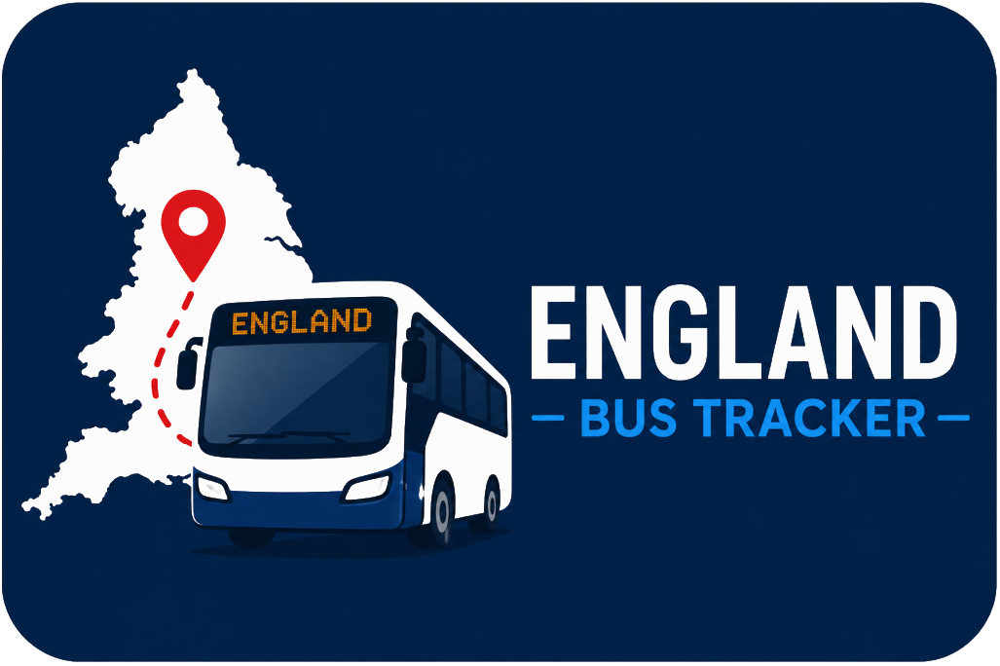
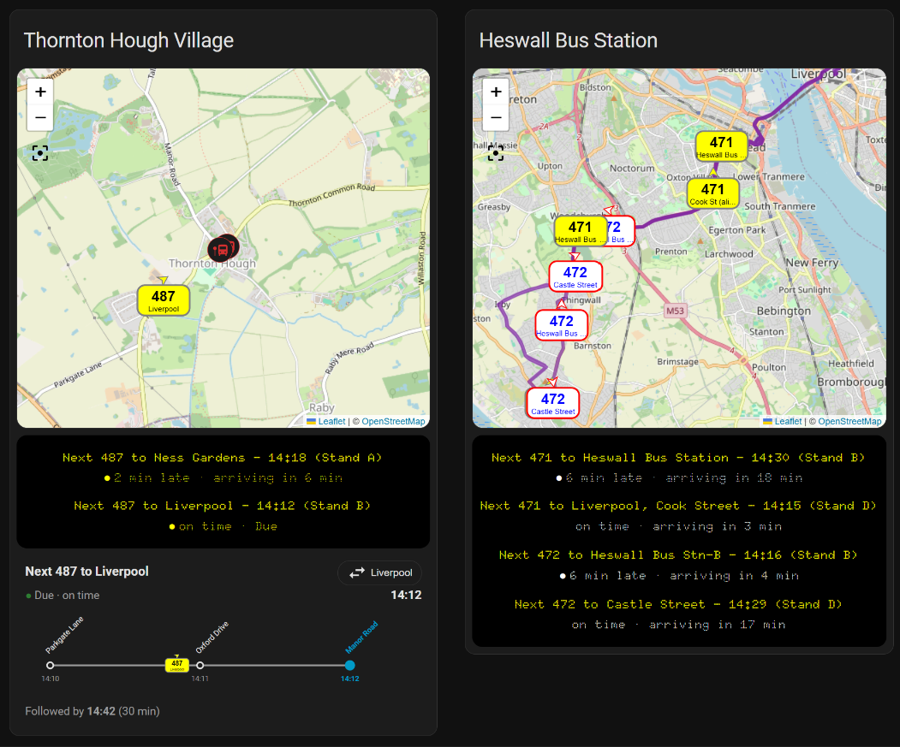
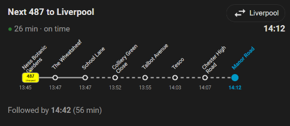

  

<h1 align="center">England Bus Tracker Card</h1>

  The companion Lovelace card for the
  <a href="https://github.com/davidh62/england-bus-tracker">England Bus Tracker</a>
  integration — a live board, map and platform-sign ladder, built entirely from
  a visual editor with zero YAML.

  
  

---

This card is the front end for the
[England Bus Tracker](https://github.com/davidh62/england-bus-tracker)
integration. Pick your monitor from a dropdown and it discovers everything else
by itself — no entity IDs, no templates, no card-mod. It has three composable
sections you can toggle and reorder:

- **Departure board** — the next buses at your stop(s), with a live dot,
  delays and a dot-matrix "classic" colourway (fully recolourable).
- **Map** — every tracked bus as a route-coloured badge, your stops marked,
  and the road-following route line where the operator publishes one.
- **Route ladder** — a rail-platform-style sign: the next bus's headline time,
  a strip showing it crawling *toward your stop*, a "followed by" line, and a
  direction chip to flip between destinations.

## Requirements

- The **[England Bus Tracker](https://github.com/davidh62/england-bus-tracker)**
  integration, set up with at least one monitor.
- **For the map section only:** [ha-map-card](https://github.com/nathan-gs/ha-map-card)
  and [auto-entities](https://github.com/thomasloven/lovelace-auto-entities)
  (both available in HACS). The board and ladder need nothing extra.

## Installation

### Via HACS (custom repository)

1. In HACS, open the three-dot menu → **Custom repositories**.
2. Add `https://github.com/davidh62/england-bus-tracker-card` with category
   **Lovelace**.
3. Find **England Bus Tracker Card** in HACS and install it.
4. HACS adds the dashboard resource automatically. (Manual install: add
   `/local/england-bus-tracker-card.js` as a **JavaScript module** resource.)

### Manual

Copy `dist/england-bus-tracker-card.js` into `config/www/` and add it as a
dashboard resource (Settings → Dashboards → ⋮ → Resources → JavaScript module).

## Usage

1. Edit a dashboard → **Add card** → search **England Bus Tracker Card**.
2. In the editor, pick your **Tracker** from the dropdown. The stops and routes
   for that monitor appear automatically.
3. Toggle the sections you want (board / map / ladder), reorder them with the
   arrows, and adjust each section's options in its accordion.

That's it — no YAML required. (A code editor is available if you want it.)

### Options at a glance

- **Card** — title (or hide it), which stops and routes to show.
- **Board** — colourway (classic dot-matrix / light / follow-theme) and
  optional text, headline and background colour overrides.
- **Map** — height, zoom, tile theme, badge size, route-line on/off and a
  route-line colour override. A tight zoom (~14) frames a single stop; pulling
  back (~12) shows a whole town and every route serving it.
- **Ladder** — which bus to follow (auto, or pin a route/direction) and the
  caption line. Your chosen direction is remembered per browser.

> **Colour fields** (the board overrides and the route-line colour) take either
> a hex code like `#7b1fa2` or a standard colour name. Colour names are one word
> with **no spaces** — `darkgrey`, not `dark grey` — and your spell-checker may
> flag the correct form as a typo. See the full
> [CSS named colours](https://developer.mozilla.org/en-US/docs/Web/CSS/named-color)
> list, or use a hex code to be safe.

## Screenshots

Two monitors side by side. On the left, a village stop at map zoom 14 — a single
Liverpool-bound 487, its dot-matrix board and the platform-sign ladder. On the
right, a town centre at map zoom 12, pulled back far enough to show two
operators' 471/472 services and their purple route lines:

  

The route ladder up close — the next bus crawling toward your stop, with the
stops it will call at, elided sections dashed, and the following departure:

  

## Licence

[MIT](LICENSE) © davidh62

## Acknowledgements

- Built for the England Bus Tracker integration and the Home Assistant / HACS
  communities.
- Map section builds on
  [ha-map-card](https://github.com/nathan-gs/ha-map-card) and
  [auto-entities](https://github.com/thomasloven/lovelace-auto-entities).
- Built with the assistance of **Claude** (Anthropic). <!-- optional: keep or remove -->
